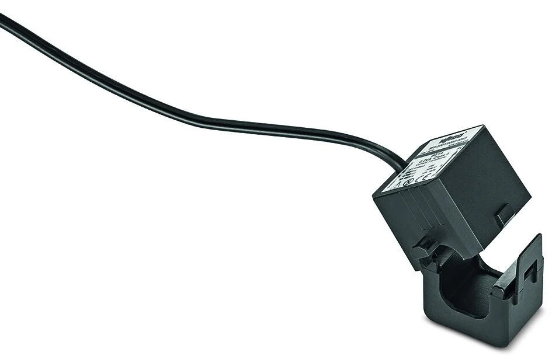
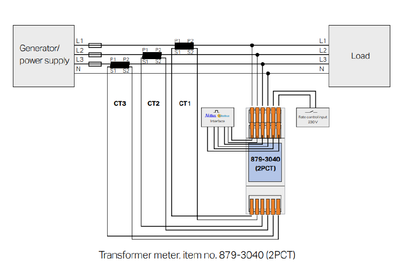
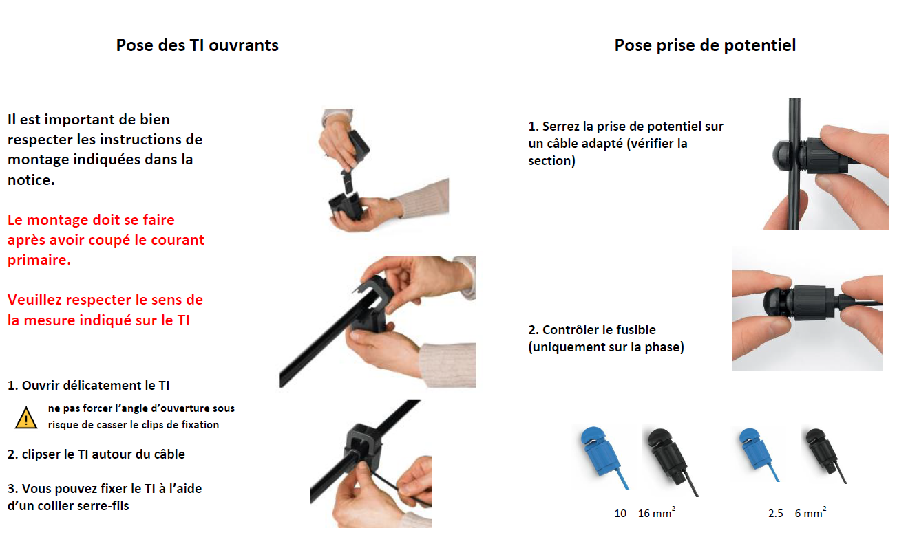
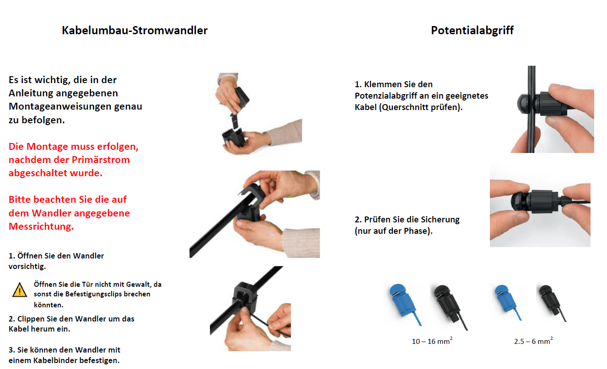
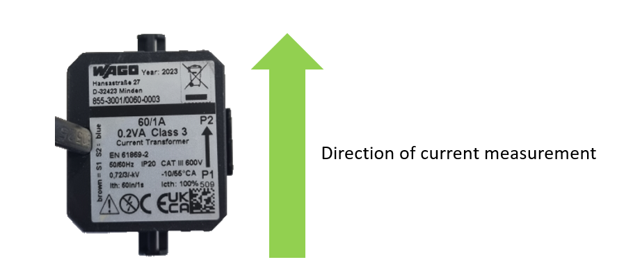
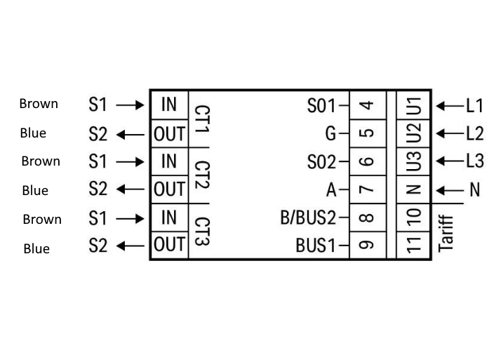

# WAGO Current Transformer
Split-core current transformer [855-3001/0060-0003](https://www.wago.com/ch-fr/gestion-de-l-%C3%A9nergie-powered-by-wago-transformateur-d-intensit%C3%A9-et-prises-de-tension/transformateurs-d-intensit%C3%A9-non-intrusifs/p/855-3001_060-003).
WAGO's compact split-core current transformers are ideal for retrofitting existing systems. 

<a href="../_documents/_CT/Operating_and_Assembly_Instruction.pdf" download="Operating_and_Assembly_Instruction.pdf">Operating_and_Assembly_Instruction</a>

!> Take note of the direction arrow on the CT when fitting.

!> Connect the CT in the correct direction on the MID meter, brown wire = S1, blue wire = S2.

> For more information about the Wago current transformers, please visit the [WAGO website](https://www.wago.com/ch-fr/gestion-de-l-%C3%A9nergie-powered-by-wago-transformateur-d-intensit%C3%A9-et-prises-de-tension/transformateurs-d-intensit%C3%A9-non-intrusifs/p/855-3001_060-003).

