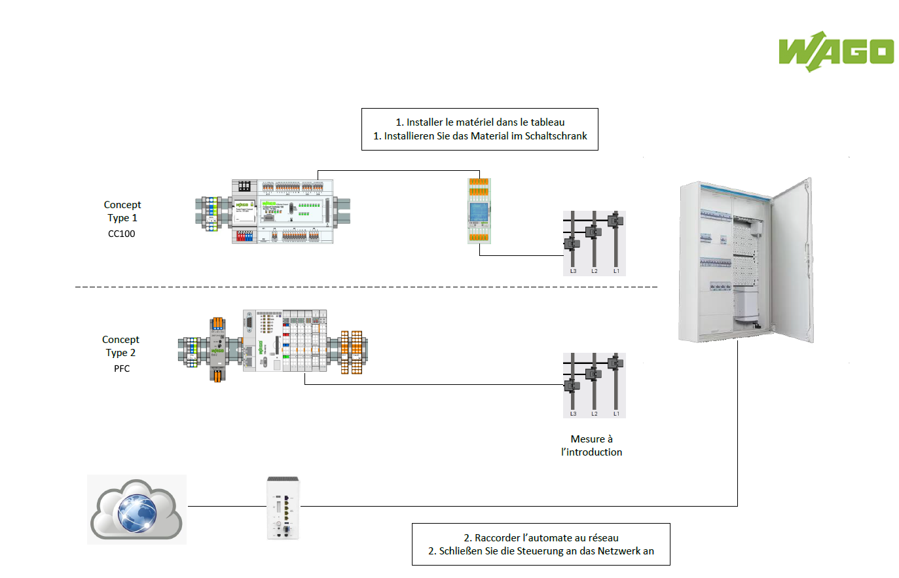
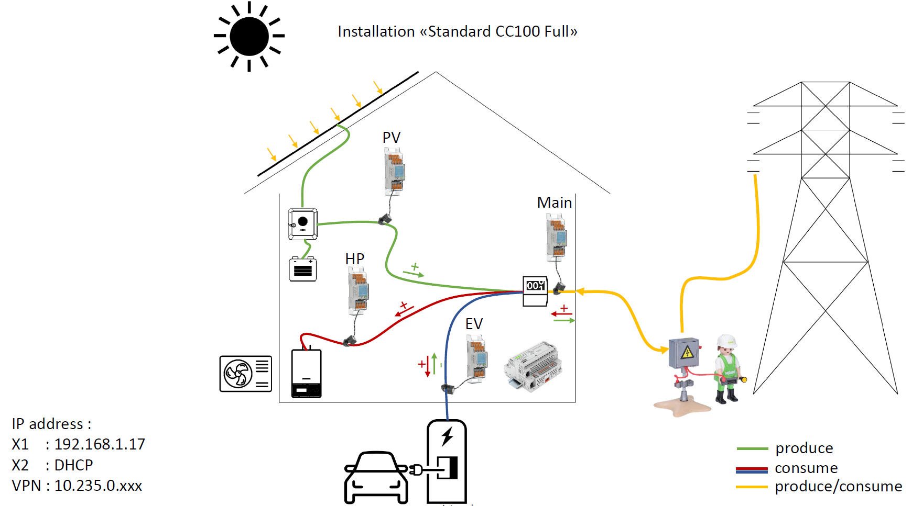
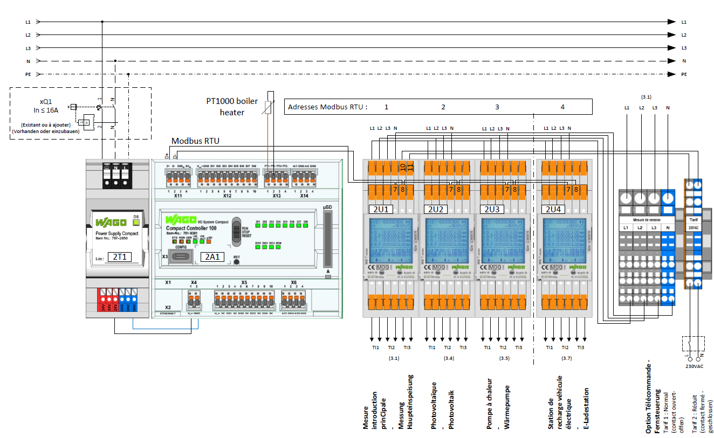
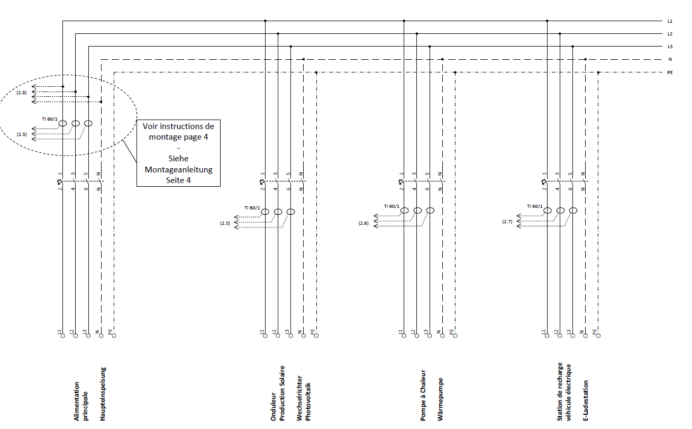

# Diagrams

## Principe Diagram 

   

   
   

## Principe MID Counter
   

   
   

# Principe Installation

   

   
   

## Electrical Box Diagram
> Measuring element wiring. 

   

   
   

   

   
   

   
   <a href="../_documents/Wago_Innosuisse _Schéma_V4.pdf" download="Wago_Innosuisse _Schéma.pdf">Wago_Innosuisse _Schéma<a>
