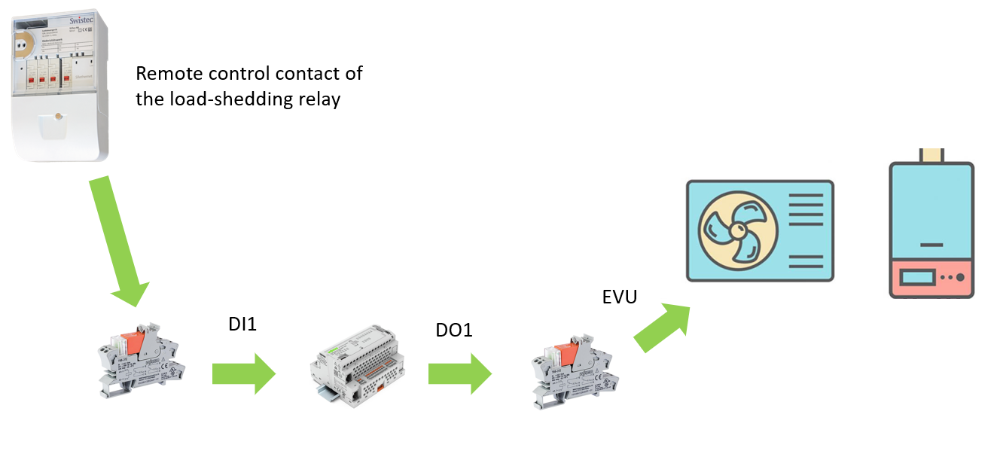

# Heat Pumps

For now, only heat pump control via [SG-Ready](6_technical/sgready), 
[Modbus](6_technical/Modbus) via manufacturer's Gateway, for example Stiebel Eltron with an [ISG-Web](https://www.stiebel-eltron.ch/de/home/produkte-loesungen/erneuerbare_energien/regelung_energiemanagement/isg-web/isg-web.html)
or simple enable/disable via load-shedding relay are supported.
Consult the heat pump documentation to identify the most suitable control mode. 

For more information, please find below the heatpump manufacturers documentation links.

!> In any case, please preferentially use the documentation provided by the manufacturer with the heat pump.
## Manufacturer documentation

- [Stiebel Eltron](https://www.stiebel-eltron.com/en/home/products-solutions/renewables/heat_pump/all-products.html)

- [Viessman](https://vibooks.viessmann.com/gb/en)

- [Daikin](https://daikintechnicaldatahub.eu/en-GB/)

- [Dimplex](https://dimplex.de/en/node/103)

- **Hoval**: no technical documentation available online.

## Load-shedding relay
For older heat pumps, which do not have SG-Ready or Modbus TCP life control, control is via the load-shedding relay. 
The electricity supplier's load-shedding relay is wired to a CC100 input via a relay to bring 24V to the input. 

<a href="../_documents/_HP_Control/SchemaDePrincipeSGready0TC_SGr-1R.pdf" download="SchemaDePrincipeSGready0TC_SGr-1R.pdf">SchemaDePrincipeSGready0TC_SGr-1R<a>

<a href="../_documents/_HP_Control/SchemaDePrincipeSGready1TC_SGr-1R.pdf" download="SchemaDePrincipeSGready1TC_SGr-1R.pdf">SchemaDePrincipeSGready1TC_SGr-1R<a>

## SGReady
[SG-Ready](6_technical/sgready) supports four operating modes for heat pumps, communicated by two contacts. 
We therefore use two relays controlled by the CC100 outputs.

<a href="../_documents/_HP_Control/SchemaDePrincipeSGready0TC_SGr-2R.pdf" download="SchemaDePrincipeSGready0TC_SGr-2R.pdf">SchemaDePrincipeSGready0TC_SGr-2R<a>

<a href="../_documents/_HP_Control/SchemaDePrincipeSGready1TC_SGr-2R.pdf" download="SchemaDePrincipeSGready1TC_SGr-2R.pdf">SchemaDePrincipeSGready1TC_SGr-2R<a>

<a href="../_documents/_HP_Control/SchemaDePrincipeSGready2TC_SGr-2R.pdf" download="SchemaDePrincipeSGready2TC_SGr-2R.pdf">SchemaDePrincipeSGready2TC_SGr-2R<a>

## Modbus via manufacturer Gateway
Modern heat pumps feature a gateway for communicating the various registers directly via [Modbus TCP](6_technical/modbus). 
Some manufacturers adhere to the SmartGridReady classification, which aims to standardize register classification. 
The CC100 can act on the registers via Modbus TCP and thus change the heat pump's operating mode. 

<a href="../_documents/_HP_Control/SchemaDePrincipeSGreadyModbus.pdf" download="SchemaDePrincipeSGreadyModbus.pdf">SchemaDePrincipeSGreadyModbus<a>

<a href="../_documents/_HP_Control/SchemaDePrincipeSGreadyModbus_1TC_SGr-1R.pdf" download="SchemaDePrincipeSGreadyModbus_1TC_SGr-1R.pdf">SchemaDePrincipeSGreadyModbus_1TC_SGr-1R<a>

[ISG-Web](https://www.stiebel-eltron.ch/de/home/produkte-loesungen/erneuerbare_energien/regelung_energiemanagement/isg-web/isg-web.html) is a Modbus TCP communication module for Stiebel-Eltron heatpumps. It allows access to additional data about the heat pump, such as various temperatures, and also enables control of the heat pump.

