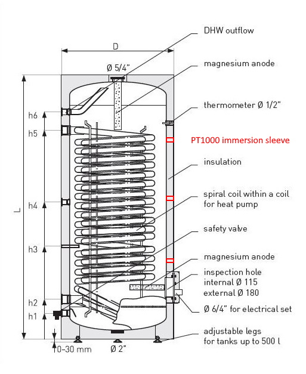
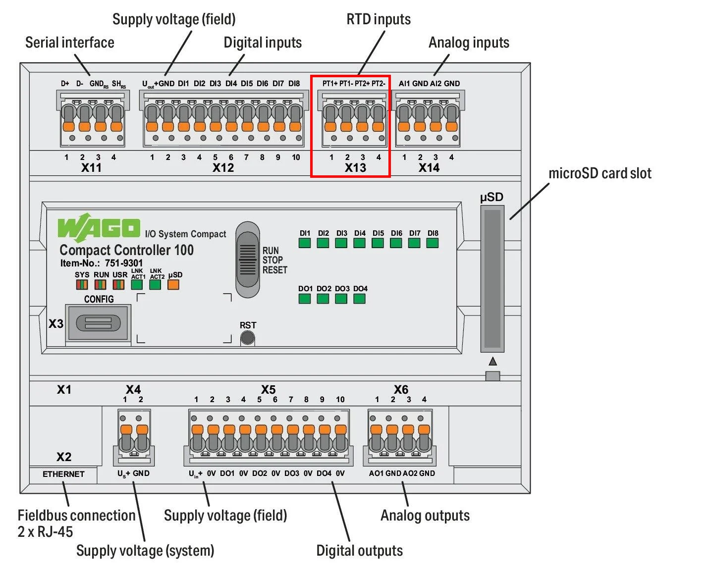

# PT1000

The temperature sensor must be placed in a free immersion sleeve on the heating water cylinder.

   
   

!> Depending on the position (high, middle, low) on the cylinder, adapt the Device Description

!> Wire the brown wire to PT+ and the black wire to PT-

   
 

   
  
 