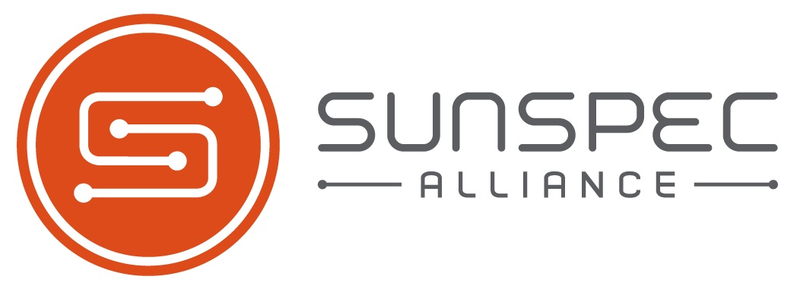

# Sunspec

## Introduction

SunSpec Alliance is a non-profit industry alliance that develops open communication standards for the renewable energy industry. These standards facilitate interoperability among various solar and energy storage components, allowing seamless communication between devices from different manufacturers. SunSpec protocols cover aspects such as solar PV systems, energy storage, and inverters. The goal is to promote standardization, enhance system reliability, and accelerate the adoption of renewable energy technologies.

## In practice

In general, SunSpec-compatible inverters operate using Modbus. SunSpec is then utilized to standardize how and where access to the data.

For more information, visit the [SunSpec Alliance website](https://sunspec.org/).