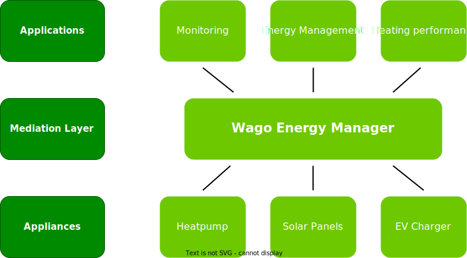

# WEM installation and commissioning documentation

Welcome to the Wago Energy Manager installation and commissioning documentation!

The pdf generated version of this documentation is available <a href="./pdf/DOCUMENTATION.pdf" download="WEM_documenation.pdf">here<a>.

[Quick Configuration](4_conf/conf) 

## Documentation structure
The documentation is organized in 5 main steps:
 
 
 

 
 
 

| [Installation](1_installation/installation) | [Appliances configuration](2_app_conf/app_conf) | [Controller Setup](3_controller_setup/controller_setup) | [Site Configuration](4_conf/conf) | [Validation](5_validation/validation) |
| ----- | ----- | ----- | ----- | ----- |
| - Cabling    - Hardware installation   - Gather appliances information | - How to configure various appliances - How to set slave id - ...                           | - How to configure the controller's firmware - How to commission the controller                  | - How to configure the endpoint description - How to commission and configure applications                     | - Validate appliances configuration - Check the values are coherent          |

## Project overview

The WEM project (Wago Energy Manager) will develop an energy management ecosystem promoting the large-scale deployment 
of efficiency and flexibility services in small buildings. The ecosystem enables a low-cost straightforward deployment of multiple services and novel business 
models.

The project consists of three main parts:

- **Cloud**: The cloud part is the central part of the ecosystem. It is responsible for the management of the devices and the services. It also provides all the
  components needed for the deployment of the services.

- **Endpoint**: The endpoint part is the part that is installed in the building. It is responsible for the communication with the devices and the cloud. It
  also provides the interface for the services and the possibility to install local applications.

- **Applications**: The applications are the services that are deployed in the ecosystem, either in the cloud, local on the endpoint or on both. They provide
  services using the device abstractions provided by the endpoint/cloud.
 
 

 
 

## Supported appliances

### Meters

- Wago MID Meter
- ABB B23/B24 Energy Meter
- [DSMR-P1](6_technical/sunspec) Meters

### Inverters

- Fronius SYMO
- Fronius GEN24
- Solaredge SE10K-RWS, SE8K-RWS ,SE7K-RWS ,SE5K-RWS
- Studer Next3
- Any [Sunspec](6_technical/sunspec) compliant inverter
- Any inverter can be metered with a Wago MID

### EV Chargers

- Zaptec Go
- ABB TERRA 3C
- KEBA P30
- EVLINK CORE, PRO, LITE
- JUICE CHARGER me 3
- Go-e Charger Gemini
- Any OCPP 1.6J EV Charger

### Heatpumps

- Stiebel Eltron WPM, LWZ
- [SG-Ready](6_technical/sgready) compatible heatpumps
- Any heatpump can be controlled by 1 or 2 relays and metered with a Wago MID